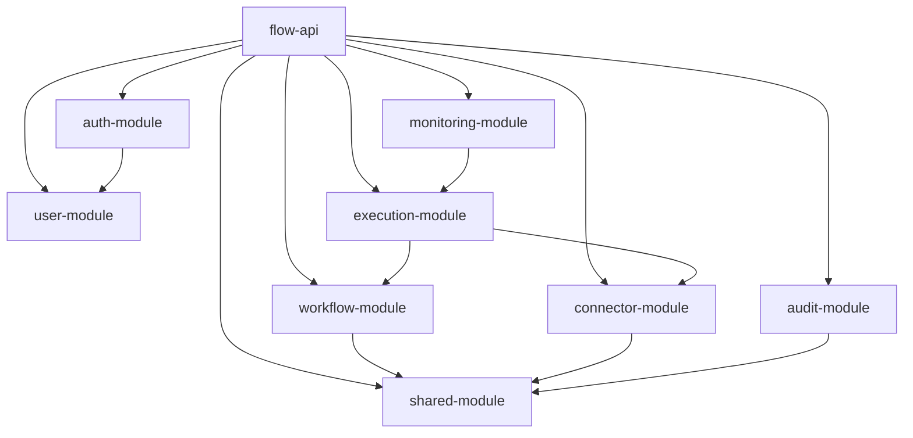

# Phase 1 Foundation Setup

## Maven Structure

```
flow-api/
|- pom.xml (parent aggregator)
|- flow-api/
|- auth-module/
|- user-module/
|- workflow-module/
|- execution-module/
|- connector-module/
|- monitoring-module/
|- audit-module/
`- shared-module/
```

## Dependency Diagram



## Notes

- No entities, APIs, or business logic are introduced in this phase.
- `flow-api` remains the only executable Spring Boot application module.
- External dependencies are configured via environment variables.

